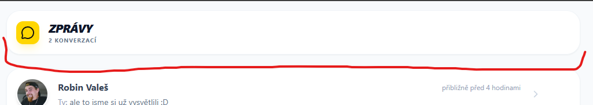

# Known Bugs
- Chrome v iOS - nefunkční tracker - prohližeč si nedokáže říct o oprávnění

 - uživatelé mohou ve starých verzích aplikace (Android) zadávat data s whitespace na konci -> kazí to filtrování -> nutno ještě jednou vyčistit scriptem

- některé stránky mají odlišné nadpisy - chceme sjednotit do stylu tracker či chats

- nejsou dodělané typy notifikací pro Market v novém rozsahu